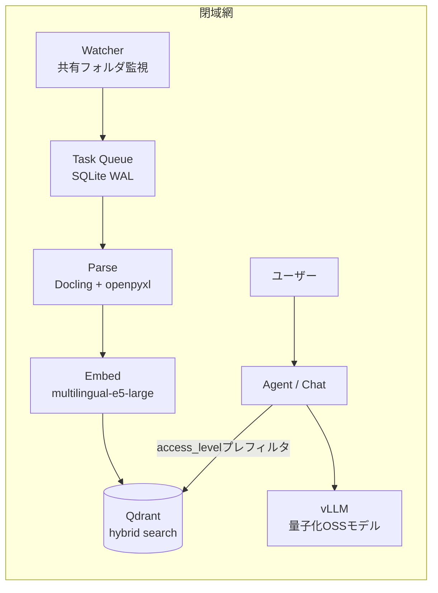

# 閉域環境向け 文書検索RAGプロトタイプ

社内規定や議事録、顧客データのような機密文書を外部APIへ送らず、閉域網で権限付き検索と根拠付き回答を行うためのプロトタイプです。主眼は、利用者の権限を検索前に適用し、社内文書から回答根拠を探す**文書検索エージェント**にあります。

汎用的な業務をすべて自動化するAIや、回答の正しさを保証するシステムではありません。検索層は小規模検証で機能していますが、最終回答の数値判断には誤りが確認されており、現時点の判定は「授業デモ可・本番利用不可」です。このリポジトリには実装コード、RAGアーキテクチャの設計判断、検証結果を収録しています。

## 現在できること・できないこと

| 区分 | 現在の範囲 |
|---|---|
| できる | ローカル文書の取り込み、Excel正規化、権限プレフィルタ、ハイブリッド検索、検索根拠を添えた回答 |
| 検証済み | 架空の人事文書6件・24検索ケースでHit@1 / Recall@5 / 権限フィルタ正答率100% |
| 制限あり | 最終回答の意味的正確性は5/6、通常回答の総時間中央値は約34.7秒（RTX 3050 Laptop 6GB） |
| できない | 回答の正確性保証、法務・労務判断の自動確定、任意の社内業務の自動実行、大規模コーパスでの品質保証 |

検索精度100%は資料6件・各1チャンクという小規模条件での結果であり、一般的な文書群へそのまま一般化できません。詳しい条件と失敗例は[GPU実機での検証結果](#gpu実機での検証結果-2026-07-28)に記載しています。

## 解決したい課題

クラウド型AIに機密文書を渡せない企業では、「社外秘にアクセスできない一般論しか答えられないAI」しか導入できていません。かといってローカルLLMを置くだけではRAGとして使いものにならず、実際に詰まるのは次の3点でした。

1. 権限管理。役員向けの資料を一般社員への回答に混ぜてはいけない
2. 日本企業のExcel。結合セルだらけの帳票はそのままベクトル化しても検索にかからない
3. 12GB VRAMという現実的な制約の中で、推論とインデックス構築を同居させること

## 全体構成



| レイヤ | 採用技術 | 選定理由 |
|---|---|---|
| 推論エンジン | vLLM | PagedAttentionでスループットを確保。ワーカー一時停止と組み合わせてGPUを取り合わない |
| LLM | OSSモデル(INT4量子化) | 12GB VRAMに載せるため量子化は必須要件として固定。モデル本体は抽象化レイヤで差し替え可能 |
| Embedding | multilingual-e5-large | 日本語事務文書のRecall@10で ruri-large と比較評価中 |
| ベクトルDB | Qdrant | Dense + Sparseのハイブリッド検索と、payload indexによる権限プレフィルタ |
| タスク管理 | SQLite(WALモード) | 外部ミドルウェアに依存させないため。閉域網では運用部品を増やすほど導入障壁になる |

## 設計判断

### 権限フィルタは検索の後ではなく前に置く

回答生成後に権限チェックする方式だと、LLMのコンテキストに権限外の文書が一度載ってしまい、要約やにじみ出しで漏れる余地が残ります。そこでユーザーの `access_level` をQdrantのpayload indexに登録し、ベクトル検索そのものにプレフィルタとして食い込ませました。権限外の文書は検索結果に最初から存在しない、という状態にしています。

認証もアカウント名照合を禁止にしました。ローカルアカウントを作れば別人になりすませるからです。デスクトップ版はWindows SID(macはUID + Directory Services UUID)で照合します。それでもOS管理者がSQLiteを直接書き換える攻撃は防げないので、その限界は隠さずドキュメントに明記し、本格的な権限分離が必要な場合はサーバー版を選ばせる構成にしました。

### 結合セルのExcelは壊してから食わせる

Doclingにそのまま渡しても、結合セル多用の帳票は表構造が崩れます。openpyxlで結合を解除して同値補完し、表の形(縦持ち、横持ち、帳票)を判定してからpandasかDoclingにルーティングする前処理を挟みました。RAGの検索精度は埋め込みモデルよりも、この手前の正規化で決まる場面が多いというのが作ってみての実感です。

### インデックス構築パイプラインは冪等にする

`PARSE → CHUNK → METADATA_EXTRACT → QA_GENERATE → EMBED → INDEX` の各フェーズでジョブIDと完了フラグをSQLiteに保存し、どこで落ちてもそのフェーズからやり直せるようにしています。閉域網のオンプレ環境では「夜間に落ちて朝まで止まっていた」が普通に起きるので、リトライで二重登録されない設計を最初から要件にしました。

### チャットが来たらバックグラウンドを止める

12GB VRAMでは、Embeddingワーカーと推論を同時に走らせるとチャットの応答が目に見えて遅くなります。ユーザー入力を検知したらバックグラウンドワーカー(Embedding、メタデータ抽出、QA生成)への新規ジョブ投入を止め、実行中のジョブだけ完了を待つ制御にしました。インデックスの鮮度より応答速度を優先する、という割り切りです。

### モデルは第一候補を決めつつ、即時切替できるようにする

第一候補のOSSモデルが試作段階でライセンスや性能が動く可能性があるため、正式採用の基準(日本語事務文書RAGで正答率80%以上、構造化出力の妥当率95%以上、ライセンス適合)を先に決め、満たさなければQwen2.5-7BやLlama-3.1-Swallow-8Bへ切り替えられる共通推論インターフェースを実装段階から用意しています。ベンチ待ちでアーキテクチャが止まらないようにするための保険です。

## リポジトリ構成

```
backend/     FastAPI。watcher / parser / indexer / retriever / reranker / chat API
frontend/    素のHTML+JS。nginx(非特権)が静的配信とbackendへのリバースプロキシを兼ねる
evaluation/  50問の評価ハーネスと架空企業コーパス
docker-compose.yml  qdrant / vllm / backend / frontend の4サービス
RAG要件定義.md / 企画書.md  設計時のドキュメント
```

## 動かす

GPUマシン(VRAM 12GB以上)とNVIDIA Container Toolkitが前提です。

```bash
cp .env.example .env      # SECRET_KEY を openssl rand -hex 32 で埋める
docker compose up -d
```

モデルの重みはリポジトリに含めていません。LLM・埋め込み・リランカーはいずれも初回起動時にHuggingFaceから取得し、Dockerボリューム `hf_cache` に載ります。閉域網へ持ち込む場合は、インターネットに繋がる環境で一度起動してキャッシュを作るか、重みを先に配って `hf_cache` へマウントしてください。閉域で完結するのは運用時の推論と検索であって、セットアップまでオフラインというわけではありません。

UIは `http://localhost:3000`。backend / Qdrant / vLLM はホストへ公開せず、frontendのリバースプロキシ経由でだけ触れます。無認証のQdrantを直接叩かれると権限フィルタを丸ごとバイパスできるため、ポートを開けない構成そのものが権限管理の一部になっています。

監視対象フォルダは `volumes/watched/` にマウントし、管理画面でフォルダごとに access_level を設定します。

## 評価

`evaluation/` に50問のデータセットと、それが接地している架空企業のコーパスを同梱しています。「答えられること」だけでなく「答えてはいけないこと」を測るのが主眼で、権限外文書への質問8問とコーパスに存在しない事項への質問8問は、拒否できて初めて正解になります。

```bash
cd backend && .venv/bin/python ../evaluation/run_eval.py --rerank both   # リランカー有無のA/B
```

テストは backend 136 / evaluation 85 が通ります。データセットのキーワードと出典が実際にコーパス本文へ接地しているかも、テストで機械的に担保しています。

## GPU実機での検証結果 (2026-07-28)

RTX 3050 Laptop 6GB の実機で、架空企業の人事文書6件・24ケースを流しました。良かったところと駄目だったところを両方書きます。

| 対象 | 結果 |
|---|---|
| Hit@1 / Recall@5 / MRR | 100% / 100% / 1.000 (リランクON・OFFとも) |
| 権限フィルタ正答率 | 100% (下位権限へ上位文書が漏れたケース0件) |
| データ整合性 | 実ファイル / SQLite / Qdrant が6件一致、SHA-256も全件一致 |
| 意味的正確性 | 5/6 (83.3%) |
| First token p50 | 約26.9秒 (目標5秒に対して未達) |
| Total latency p50 | 約34.7秒 (目標15秒に対して未達) |

検索層と権限制御は狙いどおり動きました。一方で**回答生成のLLMが数値比較を1件間違えています**。5,000円の領収書について「1件1万円以上なら部門長承認」という条文を正しく引用しながら、5,000円に対してその条件を適用してしまいました。検索は成功していて、間違えたのは最終回答のモデルです。

ここから学んだのは、キーワード包含率100%を正答率100%として扱ってはいけない、ということです。金額・日数・大小関係・期限は、キーワードが合っていても結論が逆になり得ます。対策として、検索スコアの閾値による「資料なし」の決定的判定と、金額や日付をPython側で原文と突き合わせる数値検証ガードを次の改修に入れます。

性能未達の原因ははっきりしていて、6GB VRAMに対して約7.1GBのAWQモデルをCPUへオフロードしていることと、意図判定と回答生成を直列で回していることです。VRAMに余裕のある環境での再測定が要ります。

なお検索精度100%は、資料6件・各1チャンクという小規模条件での値です。同梱の50問データセットでの実走はまだ済んでいません。この数字を一般化はできません。

## 残作業

同梱の50問ハーネスによる実走と、その結果を踏まえたSparse検索方式・埋め込みモデル(e5-large vs ruri-v3)の切り替え判断。上に書いた数値検証ガードと検索閾値の実装。コンテナのread_only化が実運用で悪さをしないかの継続観察。

権限管理の限界も隠さず書いておくと、OS管理者がSQLiteを直接書き換える攻撃は防げません。そこまでの分離が要るならデスクトップ版ではなくサーバー版を選ぶ、という切り分けにしています。

## 関連

- 開発者: [Nakamura Masashi](https://github.com/Maaa2005)
- 公開中の別プロジェクト: [Stellise](https://github.com/Maaa2005/Stellise)(オンデバイスAIのiOSアラームアプリ、App Store公開中)
