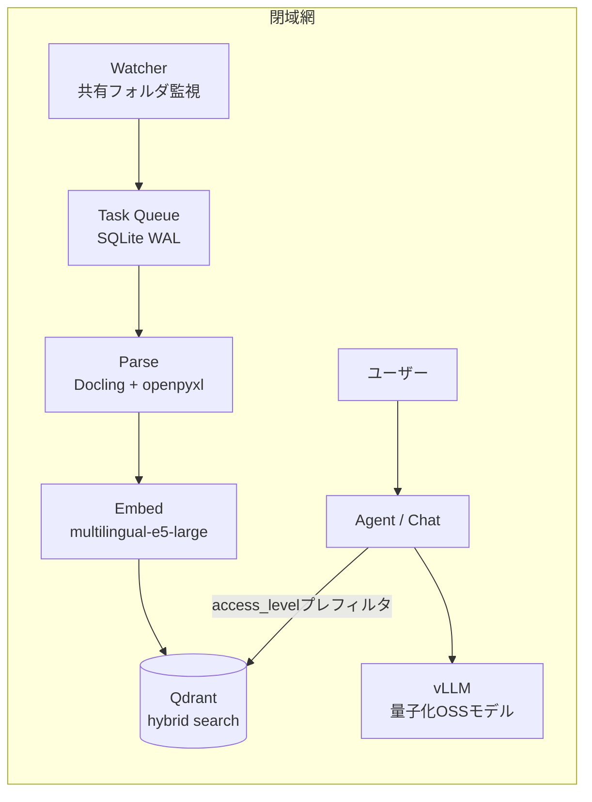

# 完全ローカル型RAGエージェント 設計ドキュメント

社内規定や議事録、顧客データのような機密文書を外部APIに一切送らず、閉域網だけで検索と回答を完結させるRAGエージェントを開発しています。実装コードは非公開のため、このリポジトリでは自分が主担当したRAGアーキテクチャの設計と、その判断理由をまとめます。

## 解決したい課題

クラウド型AIに機密文書を渡せない企業では、「社外秘にアクセスできない一般論しか答えられないAI」しか導入できていません。かといってローカルLLMを置くだけではRAGとして使いものにならず、実際に詰まるのは次の3点でした。

1. 権限管理。役員向けの資料を一般社員への回答に混ぜてはいけない
2. 日本企業のExcel。結合セルだらけの帳票はそのままベクトル化しても検索にかからない
3. 12GB VRAMという現実的な制約の中で、推論とインデックス構築を同居させること

## 全体構成

| レイヤ | 採用技術 | 選定理由 |
|---|---|---|
| 推論エンジン | vLLM | PagedAttentionでスループットを確保。ワーカー一時停止と組み合わせてGPUを取り合わない |
| LLM | OSSモデル(INT4量子化) | 12GB VRAMに載せるため量子化は必須要件として固定。モデル本体は抽象化レイヤで差し替え可能 |
| Embedding | multilingual-e5-large | 日本語事務文書のRecall@10で ruri-large と比較評価中 |
| ベクトルDB | Qdrant | Dense + Sparseのハイブリッド検索と、payload indexによる権限プレフィルタ |
| タスク管理 | SQLite(WALモード) | 外部ミドルウェアに依存させないため。閉域網では運用部品を増やすほど導入障壁になる |

## 設計判断

### 権限フィルタは検索の後ではなく前に置く

回答生成後に権限チェックする方式だと、LLMのコンテキストに権限外の文書が一度載ってしまい、要約やにじみ出しで漏れる余地が残ります。そこでユーザーの `access_level` をQdrantのpayload indexに登録し、ベクトル検索そのものにプレフィルタとして食い込ませました。権限外の文書は検索結果に最初から存在しない、という状態にしています。

認証もアカウント名照合を禁止にしました。ローカルアカウントを作れば別人になりすませるからです。デスクトップ版はWindows SID(macはUID + Directory Services UUID)で照合します。それでもOS管理者がSQLiteを直接書き換える攻撃は防げないので、その限界は隠さずドキュメントに明記し、本格的な権限分離が必要な場合はサーバー版を選ばせる構成にしました。

### 結合セルのExcelは壊してから食わせる

Doclingにそのまま渡しても、結合セル多用の帳票は表構造が崩れます。openpyxlで結合を解除して同値補完し、表の形(縦持ち、横持ち、帳票)を判定してからpandasかDoclingにルーティングする前処理を挟みました。RAGの検索精度は埋め込みモデルよりも、この手前の正規化で決まる場面が多いというのが作ってみての実感です。

### インデックス構築パイプラインは冪等にする

`PARSE → CHUNK → METADATA_EXTRACT → QA_GENERATE → EMBED → INDEX` の各フェーズでジョブIDと完了フラグをSQLiteに保存し、どこで落ちてもそのフェーズからやり直せるようにしています。閉域網のオンプレ環境では「夜間に落ちて朝まで止まっていた」が普通に起きるので、リトライで二重登録されない設計を最初から要件にしました。

### チャットが来たらバックグラウンドを止める

12GB VRAMでは、Embeddingワーカーと推論を同時に走らせるとチャットの応答が目に見えて遅くなります。ユーザー入力を検知したらバックグラウンドワーカー(Embedding、メタデータ抽出、QA生成)への新規ジョブ投入を止め、実行中のジョブだけ完了を待つ制御にしました。インデックスの鮮度より応答速度を優先する、という割り切りです。

### モデルは第一候補を決めつつ、即時切替できるようにする

第一候補のOSSモデルが試作段階でライセンスや性能が動く可能性があるため、正式採用の基準(日本語事務文書RAGで正答率80%以上、構造化出力の妥当率95%以上、ライセンス適合)を先に決め、満たさなければQwen2.5-7BやLlama-3.1-Swallow-8Bへ切り替えられる共通推論インターフェースを実装段階から用意しています。ベンチ待ちでアーキテクチャが止まらないようにするための保険です。

## 現在地と残作業

全4フェーズの実装は完了していますが、まだ完成とは言えません。GPU実機での性能判定、フロントエンドUIの確認、DBマイグレーションの検証が残っています。Embeddingモデルの比較評価(e5-large vs ruri-large)も社内ベンチ相当のデータセットで継続中です。

## 関連

- 開発者: [Nakamura Masashi](https://github.com/Maaa2005)
- 公開中の別プロジェクト: [Stellise](https://github.com/Maaa2005/Stellise)(オンデバイスAIのiOSアラームアプリ、App Store公開中)
