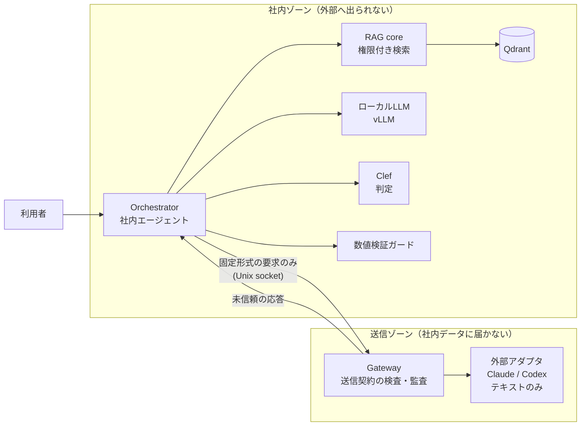

# v2 再設計: 機密ゲートウェイ型エージェント（叩き台）

状態: 設計中（2026-10-05）。決定事項と未決事項は末尾にまとめる。

## 何を作るか

社内サーバーに置いたエージェントが、社内文書を扱いながら、必要なときだけ外部の強いモデル（Claude / Codex）に仕事を頼む。外部へ渡すのは「送ってよい」と判定できたものだけで、判定できないものは送らない。

v1 は「機密文書を外部に一切出さない閉域 RAG」だった。v2 は「外部の強いモデルも使うが、何を渡したかを管理・測定できる」ことを主題にする。

## v1 から引き継ぐ前提

- 権限フィルタは検索の前に置く（v1 で権限漏洩 0 件）
- Excel の結合セル正規化など、検索精度を決める前処理
- 回答の数値（金額・日付）の誤りが v1 最大の弱点。v2 で検証ガードを持つ

## 守る原則

1. **送信は許可リスト方式**。送ってよい形式・項目を先に決め、そこから送信内容を組み立てる。マスキングは補助で、安全の根拠にしない（固有名詞の自動判別は過剰置換しやすく、名前を隠しても周辺情報で再識別できるため）
2. **不明なら送らない（fail closed）**。判定の失敗・タイムアウト・形式不正はすべて「ローカル処理または保留」に倒す
3. **外部モデルはテキストを受けて返すだけ**。ツール実行・ファイル操作・MCP・会話の継続を与えない（v1 の 7/7 判断: エージェント型の外部モデルはツール経由で社内ファイルを読めてしまう）
4. **分離は実測で示す**。外部に接続するプロセスから機密ファイル・Qdrant・vLLM に届かないことを、到達不能テストで確認するまで「分離した」と言わない
5. **データは架空のみ**。実データ相当の運用はこのリポジトリの範囲外

## 全体構成

- 社内ゾーンと送信ゾーンはネットワークを共有しない。受け渡しは固定形式の要求・応答だけを通す専用の口（Unix socket など）にする
- 外部からの応答は「未信頼の提案」として扱い、それを理由に追加の検索や実行を自動で起動しない

## 判断モデル層

判断モデルは、文章を生成せず、事前に決めた選択肢から型付きの答えを確率付きで返すモデル（System One 型）。Jev（2026-09-15）が最初で、2026-10 時点で互換モデルが多数出ている。v2 ではこの層を差し替え可能にし、役割ごとに最適なモデルを測って選ぶ。

### 共通の作り

- 呼び出しは Jev 互換の `POST /v1/systemone` 形式に統一する。質問の型は `noul`（はい/いいえ）・`choice`（選択）・`score`（段階評価）の 3 種
- 接続先（Jev / Workers AI / ローカルの llama.cpp・transformers）は設定で切り替える
- 判断ごとに、モデル名とバージョン・確率・確信度を監査ログに残す。`latest` ではなくバージョンを固定する

### 候補モデル（2026-10-05 時点、Hugging Face で実在を確認）

| モデル | 提供元 | 大きさ | ライセンス | 動かし方 | 備考 |
|---|---|---|---|---|---|
| Jev | TypeSafe AI | 非公開 | クローズド | 外部 API のみ | 社内の内容を見る判定には使わない |
| Clef | Cloudflare | 27B（約 55GB） | Apache-2.0 | Workers AI / transformers | 画像入力あり。v1 の GPU には載らない |
| Clef-flash | Cloudflare | 9B（Q4 量子化 6.49GB） | Apache-2.0 | Workers AI / llama.cpp（2026-10-03 対応マージ、テキストのみ） | 6GB GPU では一部 CPU に逃がす必要あり |
| Laya-multilingual | convai innovations | 322M | Apache-2.0 | transformers（CPU 可） | 日本語を含む 100 言語以上を明記。最大 8,192 トークン |
| Kev（0.8B / 4B / 9B） | jaredpalmer | 0.8〜9B | Apache-2.0 | ローカル（Mac で動作例あり） | Qwen3.5 ベース・英語表記 |
| Tev1（0.8B / 4B） | Together AI | 0.8〜4.7B | 未記載 | ローカル | experimental。ライセンス未記載のため採用前に要確認 |
| decider（0.8B / 2B / 4B） | Mapika | 0.8〜4B | Apache-2.0 | ローカル | 英語表記 |
| JEV-9B / JEV-27B | autotrust | 9B / 27B | Apache-2.0 | ローカル | 英語表記 |

日本語での精度はモデルごとに公表値がまちまちで、英語中心に学習されたものが多い。架空の日本語データで実測してから役割に割り当てる。

### 役割

| # | 役割 | 問いの形 | 置き場所 | 取り入れた使い方 |
|---|---|---|---|---|
| C1 | 振り分け | この依頼は「コードで処理 / ローカル LLM / 外部（Claude）/ 外部（Codex）/ 人に回す / 断る」のどれか | 社内ゾーン | カスケード型。判断モデルは振り分けだけを担い、高い LLM の呼び出しを減らす |
| C2 | 送信ゲート（止めるだけ） | この送信要求に、送ってはいけない情報が含まれるか | 社内ゾーン | 確信度で段階を分ける。リスクの高い送信ほど厳しい閾値にし、閾値に届かなければ保留。許可の根拠にはしない |
| C3 | 隠す候補の確認（補助） | 正規表現・固有表現抽出が見つけた語句について「特定の人・組織・案件を指すか」 | 社内ゾーン | コードが先に検出し、判断モデルは 1 問だけ答える 2 段構成（jevals の PHI 検出と同じ形）。検出漏れを理由に送信を許可しない |
| C4 | 回答の根拠チェック | 回答の各主張について「この主張は根拠文書に支持されるか」「この数値は同じ対象・条件について述べたものか」 | 社内ゾーン | 主張ごとに分解して聞く。**金額の大小・日付の前後の比較はコードで行う**（判断モデルは計算と日付比較が苦手と各所で報告されている） |
| C5 | 外部応答の受け入れ判定 | 応答は依頼に答えているか / 指示の注入や危険な操作を含むか / 品質は何段階か | どちらでも可 | 複数の観点を別々に採点し、重みづけはコード側で行う（合成スコア） |
| C6 | モデル比較 | 同じ判断を複数モデルに投げ、一致率・確率の当たり具合・速さ・費用を比べる | 架空データのみ | 判断結果を記録しておき、後から別モデルで再実行して一致率で置き換えを決める（例: 一致率 90% 以上なら安いモデルへ） |

全役割に共通して取り入れる使い方:

- 1 回の要求に質問をまとめて投げる（判断モデルは出力が安く、質問を増やしても待ち時間がほぼ増えない）
- 判断の前に検索結果を絞る。無関係な情報を入れるほど精度が落ちる
- 利用者が書いた文は攻撃的な入力になりうる。指示の注入を評価ケースに入れる
- 否定や暗黙の条件は字義どおりに解釈されやすいので、質問文で明示する

Jev は外部 API なので、C1〜C4 のように社内の内容を見る判定には使わない。判定を頼んだ時点で送信済みになるため。

### どこで動かすか

- 開発中（架空データ）: Workers AI の Clef / Clef-flash と、ローカルの Laya-multilingual を併用する
- 社内ゾーンでの実行: まず Laya-multilingual（CPU 可）と Clef-flash Q4（llama.cpp）を v1 の GPU 環境で試す。Clef（27B）は GPU を確保できるまで Workers AI のみ
- Workers AI 経由で社内ゾーンの判定（C1〜C4）を動かしている間は、「外部に出していない」と主張しない

### 参考にした事例

- 設計パターン（並列の質問・確信度で段階を分ける・合成スコア・カスケード・検索してから判断）と既知の弱点: https://dev.to/valyuai/how-to-use-jev-a-practical-guide-to-typesafes-system-one-model-g5e
- 評価とガードレールを判断モデルの質問で表現し、ローカル（Kev / Laya）でも動かす: https://github.com/openlayer-ai/jevals
- LLM による判定と Jev の比較: https://github.com/deepansh-saxena/jev-guardrails
- 記録した判断を再実行して Jev→Clef の置き換えを判定: https://github.com/Nishfleet/0509/issues/6381
- Clef の仕様と API: https://blog.cloudflare.com/clef-decision-models/ ・ https://huggingface.co/Cloudflare/clef-flash
- llama.cpp の Clef 対応: https://github.com/ggml-org/llama.cpp/pull/29831
- Laya-multilingual: https://huggingface.co/convaiinnovations/laya-multilingual

## 評価

固定の評価ケースを先に作り、ケースごとに「送ってよい / ローカル専用 / 含まれる禁止情報」を決めてから測る。

| 指標 | 定義 |
|---|---|
| 誤送信率 | 外部へ送ったローカル専用ケース数 / ローカル専用ケース数 |
| 禁止情報の流出 | 実際の送信内容に禁止情報があったケース数 / 禁止情報を含むケース数 |
| 誤遮断率 | 止めてしまった送信可能ケース数 / 送信可能ケース数 |
| タスク成功率 | 正解条件を満たしたケース数 / 回答可能なケース数 |
| 外部利用率 | 外部へ送ったケース数 / 全ケース数 |
| 数値ガード | 誤った断定・正しい回答・保留の件数を分けて変更前後で比較 |

- 通信エラーで送れなかったものを「誤送信 0」に数えない（送信試行と API 呼び出しを分けて記録する）
- 到達不能テストは内容評価とは別に合否を出す。対象サービスが動いていて、許可された側からは使えることも同時に確認する
- 少数ケースで 0 件だったことを「漏洩確率 0」とは書かない

## 進め方（案）

| 期限 | 到達点 |
|---|---|
| 10/12 | 設計確定。架空データセット（文書・利用者・権限）と評価ケース |
| 10/18 | Orchestrator と Gateway の骨格。判断モデル層（`/v1/systemone` 互換・接続先切り替え）。C1 振り分け・C2 送信ゲート。外部は Claude と Codex・テキストのみ |
| 10/26 | 2 ゾーン分離（Docker の内部ネットワーク＋専用の受け渡し口）と到達不能テスト |
| 11/8 | RAG core の移植、C3 隠す候補の確認、C4 根拠チェック、C5 応答判定、C6 モデル比較（日本語の実測を含む） |
| 11/13 | 評価結果・README・短いデモ。未達部分は未実装と明記 |

期限は範囲を縮める判断日として使い、自動では延ばさない。

## 決定事項（2026-10-05）

1. リポジトリ: このリポジトリの v2 として作り直す。v1→v2 で何を変えたかをそのまま説明できるため
2. 判断モデルの必須役割: C1 振り分け・C2 送信ゲート・C6 モデル比較。C6 があると他の役割のモデル選びを数字で説明できる
3. 社内ゾーンの判断モデル: Laya-multilingual と Clef-flash Q4 を v1 の GPU 環境で試し、足りなければ GPU を検討する
4. データ: 全工程で架空データのみ
5. 外部モデル: Claude と Codex の両方。どちらも API のテキスト生成としてだけ使い（Claude は Messages API、Codex は OpenAI API）、CLI やエージェント機能・ツール実行は使わない。どちらに頼むかは C1 の振り分けで決める

## 決めること

1. 費用の上限: Workers AI・Claude API・Jev API の月額上限
