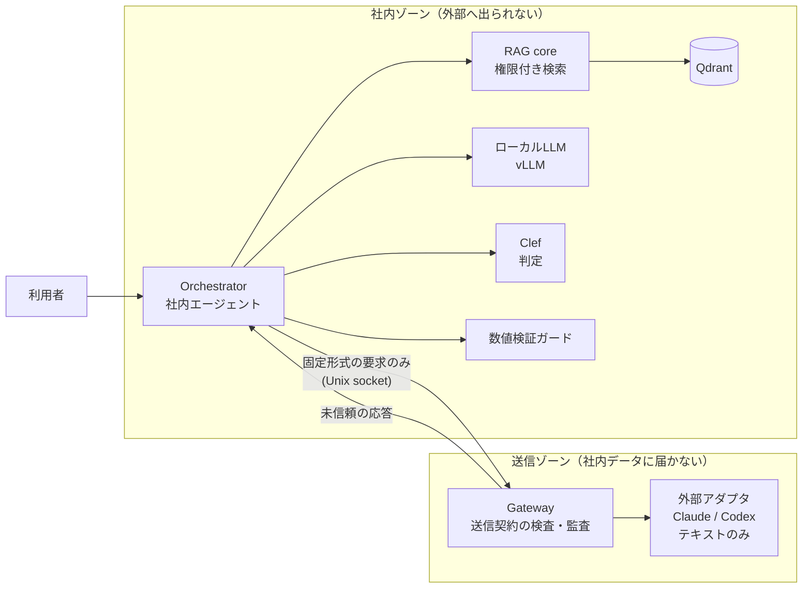

# v2 再設計: 機密ゲートウェイ型エージェント

状態: 設計中（2026-10-05）。決定事項は末尾にまとめる。

## 何を作るか

社内サーバーに置いたエージェントが、社内文書を扱いながら、必要なときだけ外部の強いモデル（Claude / Codex）に仕事を頼む。外部へ渡すのは「送ってよい」と判定できたものだけで、判定できないものは送らない。

v1 は「機密文書を外部に一切出さない閉域 RAG」だった。v2 は「外部の強いモデルも使うが、何を渡したかを管理・測定できる」ことを主題にする。

## v1 から引き継ぐ前提

- 権限フィルタは検索の前に置く（v1 で権限漏洩 0 件）
- Excel の結合セル正規化など、検索精度を決める前処理
- 回答の数値（金額・日付）の誤りが v1 最大の弱点。v2 で検証ガードを持つ

## 守る原則

1. **送信は許可リスト方式**。送ってよい形式・項目を先に決め、そこから送信内容を組み立てる。マスキングは補助で、安全の根拠にしない（固有名詞の自動判別は過剰置換しやすく、名前を隠しても周辺情報で再識別できるため）
2. **不明なら送らない（fail closed）**。判定の失敗・タイムアウト・形式不正はすべて「ローカル処理または保留」に倒す
3. **外部モデルはテキストを受けて返すだけ**。ツール実行・ファイル操作・MCP・会話の継続を与えない（v1 の 7/7 判断: エージェント型の外部モデルはツール経由で社内ファイルを読めてしまう）
4. **分離は実測で示す**。外部に接続するプロセスから機密ファイル・Qdrant・vLLM に届かないことを、到達不能テストで確認するまで「分離した」と言わない
5. **データは架空のみ**。実データ相当の運用はこのリポジトリの範囲外

## 全体構成



- 社内ゾーンと送信ゾーンはネットワークを共有しない。受け渡しは固定形式の要求・応答だけを通す専用の口（Unix socket など）にする
- 外部からの応答は「未信頼の提案」として扱い、それを理由に追加の検索や実行を自動で起動しない

## 判断モデル層

判断モデルは、文章を生成せず、事前に決めた選択肢から型付きの答えを確率付きで返すモデル（System One 型）。Jev（2026-09-15）が最初で、2026-10 時点で互換モデルが多数出ている。v2 ではこの層を差し替え可能にし、役割ごとに最適なモデルを測って選ぶ。

### 共通の作り

- 呼び出しは Jev 互換の `POST /v1/systemone` 形式に統一する。質問の型は `noul`（はい/いいえ）・`choice`（選択）・`score`（段階評価）の 3 種
- 判断モデルはすべて導入先の GPU サーバー上で動かす（llama.cpp・transformers）。外部 API（Jev・Workers AI など）は使わない
- どのモデルを使うかは設定で切り替え、GPU の規模に合わせた構成を用意する
- 判断ごとに、モデル名とバージョン・確率・確信度を監査ログに残す。`latest` ではなくバージョンを固定する

### 候補モデル（2026-10-05 時点、Hugging Face で実在を確認）

| モデル | 提供元 | 大きさ | ライセンス | 動かし方 | 備考 |
|---|---|---|---|---|---|
| Jev | TypeSafe AI | 非公開 | クローズド | 外部 API のみ | **製品では使わない**（社内の処理に外部 API を使わないため）。API 形式の基準としてだけ参照 |
| Clef | Cloudflare | 27B（約 55GB） | Apache-2.0 | transformers / llama.cpp（GGUF あり） | 画像入力あり。v1 の GPU には載らない |
| Clef-flash | Cloudflare | 9B（Q4 量子化 6.49GB） | Apache-2.0 | llama.cpp（2026-10-03 対応マージ、テキストのみ）/ transformers | 6GB GPU では一部 CPU に逃がす必要あり |
| Laya-multilingual | convai innovations | 322M | Apache-2.0 | transformers（CPU 可） | 日本語を含む 100 言語以上を明記。最大 8,192 トークン |
| Kev（0.8B / 4B / 9B） | jaredpalmer | 0.8〜9B | Apache-2.0 | ローカル（Mac で動作例あり） | Qwen3.5 ベース・英語表記 |
| Tev1（0.8B / 4B） | Together AI | 0.8〜4.7B | 未記載 | ローカル | experimental。ライセンス未記載のため採用前に要確認 |
| decider（0.8B / 2B / 4B） | Mapika | 0.8〜4B | Apache-2.0 | ローカル | 英語表記 |
| JEV-9B / JEV-27B | autotrust | 9B / 27B | Apache-2.0 | ローカル | 英語表記 |

日本語での精度はモデルごとに公表値がまちまちで、英語中心に学習されたものが多い。架空の日本語データで実測してから役割に割り当てる。

### 役割

| # | 役割 | 問いの形 | 置き場所 | 取り入れた使い方 |
|---|---|---|---|---|
| C1 | 振り分け | この依頼は「コードで処理 / ローカル回答 / 契約 A / 契約 B / 人に回す / 拒否」のどれか（外部経路は契約版の唯一の許可宛先を返す。契約 A は Claude、契約 B は Codex） | 社内ゾーン | カスケード型。判断モデルは振り分けだけを担い、高い LLM の呼び出しを減らす。経路の候補を選ぶだけで権限は与えない |
| C2 | 送信ゲート（止めるだけ） | 確定した送信内容全体に、送ってはいけない情報が含まれるか | 社内ゾーン | 確信度で段階を分ける。リスクの高い送信ほど厳しい閾値にし、閾値に届かなければ保留。許可の根拠にはしない |
| C3 | 隠す候補の確認（補助） | 正規表現・固有表現抽出が見つけた語句について「特定の人・組織・案件を指すか」 | 社内ゾーン | コードが先に検出し、判断モデルは 1 問だけ答える 2 段構成（jevals の PHI 検出と同じ形）。検出漏れを理由に送信を許可しない |
| C4 | 回答の根拠チェック | 回答の各主張について「この主張は根拠文書に支持されるか」「この数値は同じ対象・条件について述べたものか」 | 社内ゾーン | 主張ごとに分解して聞く。**金額の大小・日付の前後の比較はコードで行う**（判断モデルは計算と日付比較が苦手と各所で報告されている） |
| C5 | 外部応答の受け入れ判定 | 応答は依頼に答えているか / 指示の注入や危険な操作を含むか / 品質は何段階か | どちらでも可 | 複数の観点を別々に採点し、重みづけはコード側で行う（合成スコア） |
| C6 | モデル比較 | 同じ判断を複数のローカルモデルに投げ、一致率・確率の当たり具合・速さ・GPU メモリ使用量を比べる | 架空データのみ | 判断結果を記録しておき、後から別モデルで再実行して比べる。正解付きケースでの禁止例の見逃し・許可例の誤遮断を必ず見て、一致率だけでは置き換えない |

初版で作るのは C1・C2・C6。C3・汎用の C4・C5 は後回しにし、C4 の代わりに限定した数値ガード（F7）を入れる。C5 を外しても、外部応答の安全な表示・サイズ制限・自動実行の禁止は残す。

全役割に共通して取り入れる使い方:

- 1 回の要求に質問をまとめて投げる（判断モデルは出力が安く、質問を増やしても待ち時間がほぼ増えない）
- 判断の前に検索結果を絞る。無関係な情報を入れるほど精度が落ちる
- 利用者が書いた文は攻撃的な入力になりうる。指示の注入を評価ケースに入れる
- 否定や暗黙の条件は字義どおりに解釈されやすいので、質問文で明示する

判断モデルは社内の内容を見るので、すべて社内ゾーンで動かす。外部 API の判断モデル（Jev など）に判定を頼むと、その時点で内容を送信したことになるため使わない。

### どこで動かすか

社内の処理（ローカル LLM・判断モデル・RAG）はすべて導入先の GPU サーバーのリソースで動かす。GPU の規模に応じて構成を選べるようにする。

| 構成 | 想定 GPU | 判断モデル | 備考 |
|---|---|---|---|
| 小 | VRAM 6〜12GB | Laya-multilingual（CPU 可）＋ Clef-flash Q4 | 開発はこの構成（v1 の RTX 3050 Laptop 6GB）。Clef-flash は一部 CPU に逃がす |
| 中 | VRAM 24GB 前後 | Clef-flash（Q8 / BF16） | ローカル LLM と同居できるかを実測する |
| 大 | VRAM 80GB 級 | Clef（27B） | 開発環境では検証できないため、対応は「設定で切り替えられる」までとし、性能は未検証と明記する |

### 参考にした事例

- 設計パターン（並列の質問・確信度で段階を分ける・合成スコア・カスケード・検索してから判断）と既知の弱点: https://dev.to/valyuai/how-to-use-jev-a-practical-guide-to-typesafes-system-one-model-g5e
- 評価とガードレールを判断モデルの質問で表現し、ローカル（Kev / Laya）でも動かす: https://github.com/openlayer-ai/jevals
- LLM による判定と Jev の比較: https://github.com/deepansh-saxena/jev-guardrails
- 記録した判断を再実行して Jev→Clef の置き換えを判定: https://github.com/Nishfleet/0509/issues/6381
- Clef の仕様と API: https://blog.cloudflare.com/clef-decision-models/ ・ https://huggingface.co/Cloudflare/clef-flash
- llama.cpp の Clef 対応: https://github.com/ggml-org/llama.cpp/pull/29831
- Laya-multilingual: https://huggingface.co/convaiinnovations/laya-multilingual

## 評価

固定の評価ケースを先に作り、ケースごとに「送ってよい / ローカル専用 / 含まれる禁止情報」を決めてから測る。

| 指標 | 定義 |
|---|---|
| 誤送信率 | 外部へ送ったローカル専用ケース数 / ローカル専用ケース数 |
| 禁止情報の流出 | 実際の送信内容に禁止情報があったケース数 / 禁止情報を含むケース数 |
| 誤遮断率 | 止めてしまった送信可能ケース数 / 送信可能ケース数 |
| タスク成功率 | 正解条件を満たしたケース数 / 回答可能なケース数 |
| 外部利用率 | 外部へ送ったケース数 / 全ケース数 |
| 数値ガード | 誤った断定・正しい回答・保留の件数を分けて変更前後で比較 |

- 通信エラーで送れなかったものを「誤送信 0」に数えない（送信試行と API 呼び出しを分けて記録する）
- 到達不能テストは内容評価とは別に合否を出す。対象サービスが動いていて、許可された側からは使えることも同時に確認する
- 少数ケースで 0 件だったことを「漏洩確率 0」とは書かない

## 送信契約と送信手順

外部へ送れるのは、版管理された「送信契約」に当てはまる内容だけ。初版は 2 件に絞る。

| 契約 | 入力 | 外部利用の許可根拠 | 用途 |
|---|---|---|---|
| A: 承認済み説明文の整形 | 登録済みの文書版＋文体・長さなどの選択値 | 対象文書版の事前承認（用途・送信先も限定） | 架空 FAQ・説明文の整形 |
| B: 汎用仕様からコード案生成 | 承認済み仕様＋短い可変の依頼文枠 1 つ＋選択値 | 固定部分は事前承認。可変部分は、その契約の依頼文について外部利用を承認できる権限を持つ本人が、確定本文を毎回承認する | 汎用 CSV 処理などのコード案（表示のみ・実行しない） |

契約は ID・版・有効/無効、用途、使える権限、入力項目と出所、禁止する情報、承認方法、文字数・判断モデルの入力トークン上限、宛先・モデル、テンプレート版、出力上限、有効期限、応答の閲覧制約を持つ。判断モデルに渡す実際の入力が上限を超えて全文を検査できないときは保留する。

### 権限の関係

```text
送信資格 = 入力に使う全資料の閲覧権限 ∧ 契約の利用権限 ∧ 各入力の当該用途・宛先への外部利用許可
送信開始 = 送信資格 ∧ 確定内容への C2 正常完了（拒否なし）∧ 同じ確定内容への利用者確認 ∧ 期限内・記録可能・未送信
```

- C1 は経路の候補を選ぶだけで権限を与えない。C2 も外部利用許可を与えない。利用者の確認操作は拒否や権限不足を上書きしない
- 契約 B の可変入力は、本人が書いた汎用依頼文に限る。RAG 結果・会話履歴・社内コードを自動で流し込まない。契約が禁止する情報を例外承認できない
- 外部応答には入力資料の閲覧制約を引き継ぐ（複数資料なら最も厳しい制約）。初版では依頼者の会話内にだけ返す

### 手順

1. Orchestrator が社内で送信内容（モデルに見せる全テキスト・宛先・契約版）を組み立て、変更不能な送信候補として保存する。編集は新しい候補として扱う
2. その候補に C2 を実行し、同じ候補を利用者に表示する。C2 結果と確認記録は候補の ID とダイジェストに結び付ける。拒否・失敗・切り捨て・確認未完了なら Gateway に本文を渡さない
3. 権限を再確認し、`prepare` で確定済みの候補を Gateway に渡す。Gateway は固定スキーマ・契約版・宛先・サイズ・期限・要求 ID を検査し、内容を保存して自分で計算したダイジェストを返す
4. Orchestrator が確認済みのダイジェストと照合し、`commit(request_id, expected_digest)` を呼ぶ（本文は再送しない）。不一致は拒否
5. Gateway は `ATTEMPTING` を記録してから、保存した内容だけを外部 API に送る。文章を追加・変更しない

この方式で言えるのは「信頼する社内コードの下で、確認対象の取り違え・確認後の変更・重複送信を検出または抑止できる」ことまで。侵害された Orchestrator による記録の偽造や、侵害された Gateway からの保持内容の保護は対象外。

### 送信状態と障害時の動き

Gateway の状態は `PREPARED → ATTEMPTING → SUCCEEDED / FAILED`。`FAILED` は `not_sent / rejected / unknown` を区別する。

| 事象 | 動作 |
|---|---|
| C2 停止・タイムアウト・入力切り捨て | Gateway に本文を渡さず、ローカル処理または保留 |
| 送信前の記録に失敗 | 外部 API を呼ばない |
| 同じ要求 ID・同じ内容の再呼び出し | 保存済みの状態を返す。新しく送らない |
| 同じ要求 ID・異なる内容 | 拒否 |
| Orchestrator が応答を受け取れない | 要求 ID で Gateway に状態を照会する |
| 外部 API への送信結果が不明 | `unknown` のまま。自動で再送しない |
| 再起動時に `ATTEMPTING` が残っている | 成功とみなさず結果不明として扱う |
| 期限切れ・権限変更 | 新しい候補として再評価・再確認 |

SDK の自動再試行は切る。同時 `commit` は DB の条件付き更新で 1 件だけ通す。

## 進め方

| 期限 | 必達の到達点 | 縮小・停止の判断 |
|---|---|---|
| 10/12 | 契約 2 件の具体例、承認権限と脅威モデル、正解付き評価ケース、Docker 方式の特定（Docker Desktop か WSL 内 Engine か）、モデルの事前取得とオフライン起動、モデル起動の予備確認 | 可変入力の承認前提が決まらなければ固定入力で先に進める |
| 10/18 | 契約 A を通しで動かす（C1 → 内容固定 → C2 → 確認 → prepare/commit → テスト用の受信先）。Laya の初期採否 | Laya が合わなければ Clef-flash の静的構成へ。判断品質を後回しにしない |
| 10/26 | 契約 B、Claude・Codex の API 接続、RAG 接続、双方向の分離試験、状態照会、重複抑止 | 文書数・入力長・同時実行数を縮める。成立しない機能は未達候補として明記 |
| 11/2 | 限定した数値ガード、説明 UI、障害・本文一致の試験。機能凍結 | 新しい役割・画面・runtime を追加しない |
| 11/8 | 固定ケースで C1・C2・C6、分離、実送信、性能を評価 | 不合格の機能は制限・無効化する。条件を緩めて合格にしない |
| 11/13 | 再現手順、構成の固定情報、評価結果、README、短いデモ | 残りは修正の予備日 |

必達: C1・C2・C6、Claude と Codex のテキスト接続、契約 2 件、権限付き RAG、限定数値ガード、送信内容の固定・記録・状態照会、分離試験、説明 UI。

後回し: 共有型マルチテナント、SSO、契約・キー・承認の管理画面、C3 と日本語 NER、汎用 C4/C5、監査ログの改ざん検知（HMAC 等）、本格的な確率校正、フロントエンド刷新、GPU の自動切り替え、複数の Docker 環境、24GB/80GB 環境での性能保証。

Clef-flash の静的構成で生成 LLM を止めている間はローカル生成が使えない。「外部委託のデモが動く」と「全機能が同時に使える」は分けて報告する。

### 未解決（実測で決める）

| 項目 | 確認方法・期限 | だめだった場合 |
|---|---|---|
| 日本語の C1・C2 に Laya が使えるか | 許可・禁止・保留、長文の末尾、否定、指示注入を含むケースで 10/18 に判断 | Clef-flash の静的構成を試す |
| Clef-flash が 6GB＋ホスト RAM で実用になるか | 生成 LLM を止めて起動・入力長・RAM/VRAM・待ち時間を測る | 対象機能を制限。起動しただけで採用済みにしない |
| Docker/WSL で分離が成立するか | ホスト・frontend 経由を含めて双方向に試験 | 最小の遮断を追加。残る経路を「分離済み」と書かない |
| 契約 A・B に業務上の価値があるか | 入力・送信本文・期待出力・拒否例を各 1 組作る | 用途・入力枠を修正。契約は増やさない |
| 6 週間で収まるか | 10/18 までの実績で更新 | 入力形式・規程数・画面を削る。安全条件は残す |

## 要求

### 機能要求

| # | 要求 | v1 との関係 |
|---|---|---|
| F1 | 共有フォルダを監視して文書を取り込む（更新・削除、Excel の結合セル正規化）。評価対象は MD / TXT / XLSX | 継承 |
| F2 | 利用者の権限を検索の前に適用する | 継承 |
| F3 | ローカル LLM で根拠付きの回答を返す | 継承 |
| F4 | C1 振り分け: コードで処理 / ローカル回答 / 契約 A / 契約 B / 人に回す（保留と理由の提示まで）/ 拒否。使えない経路は選ばない | 新規 |
| F5 | 外部委託: 送信契約と送信手順（上記）に沿って Claude / Codex の API にテキストだけを送る。任意 URL・任意ヘッダー・ツール・ファイル・外部側の会話継続は受け付けない | 新規 |
| F6 | 外部応答は信頼しないテキストとして表示する。追加検索・コード実行を自動で起こさない。サイズを制限する | 新規 |
| F7 | 限定した数値ガード: 少数の架空規程について対象・単位・比較条件・例外・根拠を構造化し、コードで検証する。分からなければ保留 | 新規（v1 の最大の弱点への対策） |
| F8 | 説明 UI: 経路・送信先・確定本文・承認根拠・拒否/保留の理由・未送信/結果不明を表示する | 新規 |
| F9 | 監査記録: 判断モデル・revision・質問の版・結果・確率、承認者と対象、実際の送信内容、要求 ID、送信結果を対応付けて残す | 拡張 |
| F10 | 評価ハーネス: 固定ケースで各指標を測り、C6 のモデル比較を再現できる | 拡張 |

### 非機能要求

| # | 要求 |
|---|---|
| N1 | 1 導入先 1 デプロイ。DB・文書・API キーは導入先ごとに分ける（共有型マルチテナントは対象外） |
| N2 | ローカル LLM・判断モデル・RAG は導入先の GPU サーバーの CPU/GPU だけで動かす。外部への接続がなくても外部委託以外は動く |
| N3 | 分離を双方向に試験する: 社内→外部（外部 API・任意 HTTP・ホスト上の中継）に出られない／Gateway→社内（文書 volume・社内 DB・Qdrant・vLLM・判断モデル）に届かない／Gateway→frontend→社内の迂回もない／正常経路は動く |
| N4 | 判定の失敗・タイムアウト・形式不正・入力切り捨ては「送らない」側に倒す |
| N5 | 外部 API キーは Gateway 専用の secret ファイル等で渡し、リポジトリ・社内コンテナ・UI・監査本文・例外ログに出さない。交換は手順と再起動で行う |
| N6 | モデルの重み・tokenizer は事前取得して revision を固定し、実行時はローカルパス・オフライン設定で起動する。取得用トークンを社内サービスに残さない |
| N7 | 保持期限（本文 30 日・メタデータ 90 日）は実装済み（Gateway の送信記録は `gateway/store.py` の `purge_expired`、監査ログ（メタデータのみ・90 日）は `orchestrator/audit_store.py` の `purge`。Gateway 側の外部 cron 用 CLI は `python -m gateway.purge`）。監査ログの改ざん検知は初版では未実装（後回し） |
| N8 | 応答時間は目標を決めず実測値を出す（v1 は 6GB 環境で中央値 約 34.7 秒） |

### 合格条件（初版）

- 固定した必須禁止ケースで、Gateway への本文受け渡し・外部送信が起きない
- 許可ケースで、契約 A・B と Claude・Codex の両方の成功を確認できる
- C2 が全件保留するだけでは合格にしない
- 確認後の変更、二重 `commit`、記録失敗、C2 停止、タイムアウト後の照会を試験する
- C2 に既知の見逃しが残る対象は、入力範囲を狭めるか無効化する
- C2 の効果は「通常の許可入力での誤遮断・保留」「禁止情報が混ざった入力での追加検出」「一連の処理で実際にどこまで渡ったか」に分けて測る。契約で先に止まった例は C2 の成果に数えない

## 技術スタック

| 層 | 採用 | 理由 |
|---|---|---|
| バックエンド | Python 3.11 / FastAPI | v1 の Dockerfile が 3.11。モデルの runtime は別に固定 |
| 社内エージェントの制御 | 小さな自前の状態遷移 | 流れが固定で短く、監査しやすい。LangGraph は使わない |
| ローカル LLM | vLLM ＋ Gemma 4 E2B AWQ-INT4 | v1 を継承。6GB で実測して判断 |
| 判断モデル | 共通アダプタ（`/v1/systemone` 互換）の裏で Laya-multilingual（transformers）と Clef-flash（llama.cpp）を比較 | 初版は C1・C2 に必要な型を優先 |
| 6GB での配置 | 通常は生成 LLM を GPU、Laya・埋め込み・reranker を CPU。Clef-flash を使うときは生成 LLM を止める静的な Compose profile に切り替える | Clef-flash と生成 LLM の GPU 同居は必達にしない |
| 埋め込み・検索 | multilingual-e5-large / Qdrant / bge-reranker-v2-m3 | v1 を継承。CPU での RAM と待ち時間も測る |
| 隠す候補の検出 | 初版は入れない。正規表現は追加の拒否検査にだけ使う | 日本語 NER（GiNZA など）の選定は C3 に着手するとき |
| Gateway | 最小構成の Python プロセス＋固定アダプタ（各社 SDK のテキスト生成のみ） | 文章を組み立て直さない |
| ゾーン間の受け渡し | HTTP over Unix ソケット＋ pydantic の固定スキーマ。Linux 側の名前付き volume で所有者・権限を絞る | ネットワークを共有しない |
| DB | 社内と Gateway で別々の SQLite。Gateway は WAL ＋ `synchronous=FULL`、ローカル volume、送信処理は 1 プロセス | 送信前の記録を電源断でも失いにくくする |
| フロントエンド | 素の JavaScript ＋ nginx。v1 の Bearer 認証・CSP を継承 | 外部応答を実行可能な HTML にしない |
| 配置 | Docker Compose。保証する Docker/WSL 構成は 1 つに固定 | 社内サービスの公開ポートをなくし、Gateway に社内 volume・Docker ソケットを渡さない |
| テスト・評価 | pytest ＋評価ハーネス＋双方向の分離試験 | `internal` ネットワークの設定名だけで合格にしない |

## 決定事項（2026-10-05）

1. リポジトリ: このリポジトリの v2 として作り直す。v1→v2 で何を変えたかをそのまま説明できるため
2. 判断モデルの必須役割: C1 振り分け・C2 送信ゲート・C6 モデル比較。C6 があると他の役割のモデル選びを数字で説明できる
3. 社内ゾーンの判断モデル: Laya-multilingual と Clef-flash Q4 を v1 の GPU 環境で試し、足りなければ GPU を検討する
4. データ: 全工程で架空データのみ
5. 外部モデル: Claude と Codex の両方。導入先の会社が自分の API キーで接続し、利用料も導入先が持つ。どちらも API のテキスト生成としてだけ使い（Claude は Messages API、Codex は OpenAI API）、CLI やエージェント機能・ツール実行は使わない。初版では、C1が処理経路を判断し、外部経路については対応する有効な契約版の唯一の許可宛先を返す。宛先の推論・代替選択は行わない。（2026-10-07 改定: 宛先は 1 契約 1 件に固定し、契約 A は Claude、契約 B は Codex。障害時に別の API へ自動で切り替えない）
6. 社内の処理: ローカル LLM と判断モデルは導入先の GPU サーバーで動かし、外部 API（Jev・Workers AI など）は使わない
7. 送信契約は 2 件で固定: A「承認済み説明文の整形」、B「汎用仕様からコード案生成（実行せず表示のみ）」
8. 利用者の自由入力は契約 B の依頼文枠 1 つだけ認める。その契約の依頼文について外部利用を承認できる権限を持つ本人が、確定本文を毎回承認する。承認者の見誤りと C2 の見逃しが重なるリスクは受け入れたうえで、評価で見逃しを測る
9. 要求・技術スタック・工程は二者協議（2026-10-05）の結論で確定。C3・汎用 C4/C5・管理画面・NER は初版から外す
