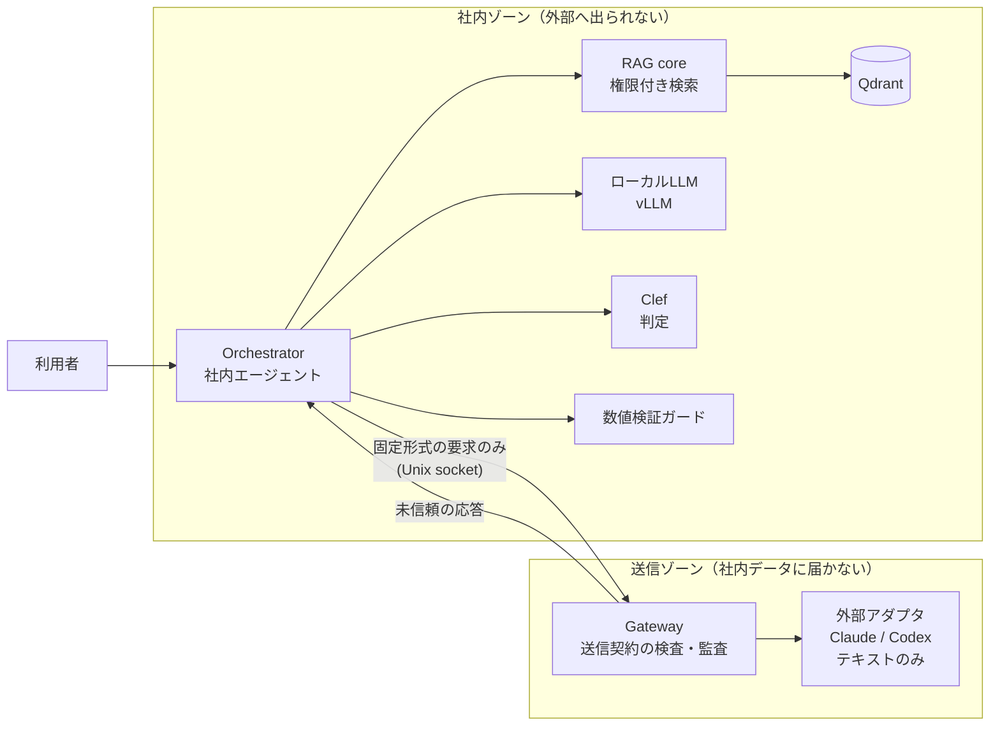

# v2 再設計: 機密ゲートウェイ型エージェント（叩き台）

状態: 叩き台（2026-10-05）。未決事項は末尾の「決めること」にまとめる。

## 何を作るか

社内サーバーに置いたエージェントが、社内文書を扱いながら、必要なときだけ外部の強いモデル（Claude / Codex）に仕事を頼む。外部へ渡すのは「送ってよい」と判定できたものだけで、判定できないものは送らない。

v1 は「機密文書を外部に一切出さない閉域 RAG」だった。v2 は「外部の強いモデルも使うが、何を渡したかを管理・測定できる」ことを主題にする。

## v1 から引き継ぐ前提

- 権限フィルタは検索の前に置く（v1 で権限漏洩 0 件）
- Excel の結合セル正規化など、検索精度を決める前処理
- 回答の数値（金額・日付）の誤りが v1 最大の弱点。v2 で検証ガードを持つ

## 守る原則

1. **送信は許可リスト方式**。送ってよい形式・項目を先に決め、そこから送信内容を組み立てる。マスキングは補助で、安全の根拠にしない（固有名詞の自動判別は過剰置換しやすく、名前を隠しても周辺情報で再識別できるため）
2. **不明なら送らない（fail closed）**。判定の失敗・タイムアウト・形式不正はすべて「ローカル処理または保留」に倒す
3. **外部モデルはテキストを受けて返すだけ**。ツール実行・ファイル操作・MCP・会話の継続を与えない（v1 の 7/7 判断: エージェント型の外部モデルはツール経由で社内ファイルを読めてしまう）
4. **分離は実測で示す**。外部に接続するプロセスから機密ファイル・Qdrant・vLLM に届かないことを、到達不能テストで確認するまで「分離した」と言わない
5. **データは架空のみ**。実データ相当の運用はこのリポジトリの範囲外

## 全体構成

- 社内ゾーンと送信ゾーンはネットワークを共有しない。受け渡しは固定形式の要求・応答だけを通す専用の口（Unix socket など）にする
- 外部からの応答は「未信頼の提案」として扱い、それを理由に追加の検索や実行を自動で起動しない

## Clef の使いどころ

Clef は Jev と API 互換の判断モデル（型付きの答えを確率付きで返す）。v2 では次の役割を候補にし、それぞれ評価で効果を測る。

| # | 役割 | 問いの形 | 置き場所の条件 |
|---|---|---|---|
| C1 | 振り分け | この依頼は「ローカルで答える / 外部に頼む / 断る」のどれか | 依頼文を見るので社内ゾーン |
| C2 | 送信ゲート（止めるだけ） | この送信要求に、送ってはいけない情報が含まれるか | 社内ゾーン。**許可には使わず、拒否・保留にだけ効く** |
| C3 | マスキング候補の検出（補助） | この語句は人名・組織名・案件名か | 社内ゾーン。検出漏れを理由に送信を許可しない |
| C4 | 数値の整合チェック | 回答中の金額・日付は根拠文書の記述と一致するか | 社内ゾーン。ルールベースの検証と比較する |
| C5 | 外部応答の受け入れ判定 | 外部の応答は依頼に答えているか / 危険な指示を含むか | どちらでも可（応答は送信済み情報から作られる） |
| C6 | Jev との比較評価 | 同じ問いを Clef / Jev に投げて精度・速さ・費用を比べる | 架空データのみ |

Jev は外部 API なので、C1〜C4 のように社内の内容を見る判定には使わない。判定を頼んだ時点で送信済みになるため。

### Clef をどこで動かすか

- 開発中（架空データ）: Workers AI の Clef / Clef-flash を使う。API 互換なので後で接続先を差し替えるだけで済む設計にする
- 社内ゾーンでの実行: Clef（27B・約 55GB）は v1 の検証 GPU（RTX 3050 Laptop 6GB）に載らない。Clef-flash（9B）は重みの配布先が未確認。GPU の確保は「決めること」に入れる
- Workers AI 経由で社内ゾーンの判定（C1〜C4）を動かしている間は、「外部に出していない」と主張しない

## 評価

固定の評価ケースを先に作り、ケースごとに「送ってよい / ローカル専用 / 含まれる禁止情報」を決めてから測る。

| 指標 | 定義 |
|---|---|
| 誤送信率 | 外部へ送ったローカル専用ケース数 / ローカル専用ケース数 |
| 禁止情報の流出 | 実際の送信内容に禁止情報があったケース数 / 禁止情報を含むケース数 |
| 誤遮断率 | 止めてしまった送信可能ケース数 / 送信可能ケース数 |
| タスク成功率 | 正解条件を満たしたケース数 / 回答可能なケース数 |
| 外部利用率 | 外部へ送ったケース数 / 全ケース数 |
| 数値ガード | 誤った断定・正しい回答・保留の件数を分けて変更前後で比較 |

- 通信エラーで送れなかったものを「誤送信 0」に数えない（送信試行と API 呼び出しを分けて記録する）
- 到達不能テストは内容評価とは別に合否を出す。対象サービスが動いていて、許可された側からは使えることも同時に確認する
- 少数ケースで 0 件だったことを「漏洩確率 0」とは書かない

## 進め方（案）

| 期限 | 到達点 |
|---|---|
| 10/12 | 設計確定。架空データセット（文書・利用者・権限）と評価ケース |
| 10/18 | Orchestrator と Gateway の骨格。Clef（Workers AI）で C1 振り分け・C2 送信ゲート。外部は Claude 1 社・テキストのみ |
| 10/26 | 2 ゾーン分離（Docker の内部ネットワーク＋専用の受け渡し口）と到達不能テスト |
| 11/8 | RAG core の移植、C4 数値ガード、C5 応答判定、C6 Jev 比較 |
| 11/13 | 評価結果・README・短いデモ。未達部分は未実装と明記 |

期限は範囲を縮める判断日として使い、自動では延ばさない。

## 決めること

1. リポジトリ: このリポジトリの v2 として作り直すか、新しいリポジトリを作るか（推奨: このリポジトリの v2。v1→v2 で何を変えたかをそのまま説明できる）
2. Clef の役割: C1〜C6 のうち、どれを必須にするか（推奨: C1・C2 を必須、C4・C6 を次点）
3. 外部モデル: 最初は Claude だけか、Codex も同時か
4. 社内ゾーンで Clef を動かす GPU をどう用意するか（用意できない間は Workers AI で開発し、その旨を明記）
5. 費用の上限: Workers AI・Claude API・Jev API の月額上限
